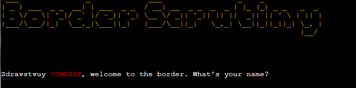

# Border Scrutiny

"Border Scrutiny" is a game in which you assume the role of a vigilant border guard. Your mission: to meticulously assess and decide the fate of individuals based on sensitive intelligence, determining whether to grant or deny them entry.

View the live site: [Border Scrutiny](https://border-scrutiny-32912c92d278.herokuapp.com)

## CONTENTS

* [Design](#design)
  * [Colours](#Colours)
  * [Art](#Art)
  * [Typography](#Typography)
  * [Flowchart](#Flowchart)

* [Features](#features)

* [Technologies Used](#technologies-used)
  * [Languages Used](#languages-used)

* [Testing](#testing)
  * [CI Python Linter](#linter)
  * [Solved Bugs](#solved-bugs)
  * [Known Bugs](#known-bugs)
  * [Functional testing](#functional-testing)
  * [Missed Opportunity](#missed-opportunity)

* [Credits](#credits)
  * [Code Used](#Code-Used)
  * [Media](#media)

## Design

### Colours

Colours used were done using ANSI code for which instructions can be found in the following link: [Colors](https://www.studytonight.com/python-howtos/how-to-print-colored-text-in-python)

### Art

To add some flare, ASCII Art was imported and used for introduction and end screen. [ASCII Art](https://pypi.org/project/art/)

### Typography

Font family Russo One was used for heading, offering a more rugged look.

### Flowchart

The flowchart follows the logic of the game, how each process interacts with data.

The flowchart helps with manually testing game functionality.

## Features

We will go trough the features of the game now.

 * Intro Section.

    * An introduction of 'Border Scrutiny'.
    * Gives title of the game and starts the game.

        

 * Name Section.

    * Continuation of the intro.
    * Gives you the input for player name, repeats it and sets up the story.

        

 * Start Section.

    * Start the game.
    * Gives you the yes or no choice to continue the game.

           
     
 * Start End Section.

    * Start or end game.
    * Makes sure you either type yes or no to the question, if the answer is no twice, the game closes.

          
    
 * Random Person Today Section.

    * Rules which have to be followed.
    * Gives you the list of randomized values on which you must keep an eye on in the next section. You must avoid letting anyone in with any of these values.

         

 * Documents section.

    * A person who has to be compared with forbidden values.
    * Pulls the random values from lists. Creates a person with a face, first name, last name, country, age and possessions.

        

 * Decision section.

    * Deicide which person fits the criteria and deicide their fate.
    * Depending on the values, the program prints if you got it right or not and either adds or removes money from saved data.

        * Basic Good Decision
            
        * Basic Bad Decision
            
        * Caught a potential spy
            
        * Missed a potential spy
               

  * End section.

    * End screen with a retry option.
    * Prints total earned money, gives yes/no input to go again.

        

 * Game Over section.

    * Game Over section.
    * Prints out Game Over in ASCII.

        

## Technologies Used

* [Visual Studio Code](https://code.visualstudio.com) - To code the website.

* [Git](https://git-scm.com) - For version control.

* [Github](https://github.com) - To save and store the files for the website.

* [Google Dev Tools](https://developer.chrome.com/docs/devtools/) - To troubleshoot and test features, solve issues with responsiveness and styling.

* [Pexels](https://www.pexels.com/) - To acquire royalty free images.

* [Pixlr](https://pixlr.com/) - To edit the images to fit the theme of the website.

* [Heroku](https://www.heroku.com) - To deploy finished project.

### Languages Used

* The project was developed using Python as a main language.
* The structure of the website was modified using HTML.
* The website was styled using CSS.

## Testing

### Linter
* Python
  * No errors were returned when passing through the official [Code Institute Python Linter](https://pep8ci.herokuapp.com)

### Solved Bugs

1. Python linter showing newline error.
      
     
      
 
      This issue was solved by adding an empty line after calling the main function.

### Known Bugs

No bugs were found by when testing the final version of the website.

### Functional Testing

## Deployment & Local Development

### Deployment

The site was created using the Visual Studio code editor and pushed to github to the remote repository ‘border-scrutiny’.

Heroku was used to deploy the live website. The instructions to achieve this are below:

1. Log in (or sign up) to Github.
2. Find the repository for this project on github, border-scrutiny and copy the link. 
3. Log in (or sign up) to Heroku.
4. Click new on the dashboard and select 'Create new app' from the drop down menu.
5. Choose app name and select your region.
6. Go to Settings.
7. Press Reveal Config Vars and add the following: in KEY write PORT, in VALUE write 8000.
8. Add buildpacks python and nodejs in that order.
9. Press deploy on menu above.
10. Connect to github, paste your repository link here and press connect.
11. After connecting choose Deploy Branch.
12. Your project is now deployed!

### Local Development

#### How to Fork

To fork the border-scrutiny repository:

1. Log in (or sign up) to Github.
2. Go to the repository for this project, bidran/border-scrutiny.
3. Click the Fork button in the top right corner.

#### How to Clone

To clone the border-scrutiny repository:

1. Log in (or sign up) to GitHub.
2. Go to the repository for this project, bidran/border-scrutiny.
3. Click on the code button, select whether you would like to clone with HTTPS, SSH or GitHub CLI and copy the link shown.
4. Open the terminal in your code editor and change the current working directory to the location you want to use for the cloned directory.
5. Type 'git clone' into the terminal and then paste the link you copied in step 3. Press enter.

### Missed Opportunity

* Had I had more time I would have liked to implement features such as :
    - A highscore sheet which saves to google drive and updates the highscores.
    - Clean up code by using more classes.
    - Used more ANSII code to style.

---------

## Credits

### Code Used

*[Text Effect Typing](https://www.101computing.net/python-typing-text-effect/)
*[Text Colors](https://www.studytonight.com/python-howtos/how-to-print-colored-text-in-python)
*[ASCII Art](https://pypi.org/project/art/)

### Media
A stock image from [Pexels](https://www.pexels.com/) was used for this project.
[Rusty fence](https://www.pexels.com/photo/old-metal-blue-lattice-with-rusty-details-on-fence-6156548/)

